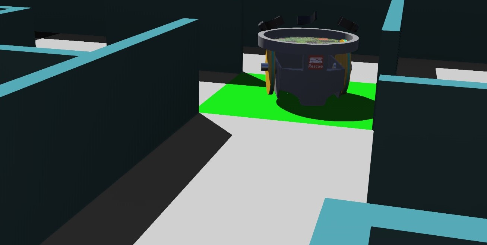
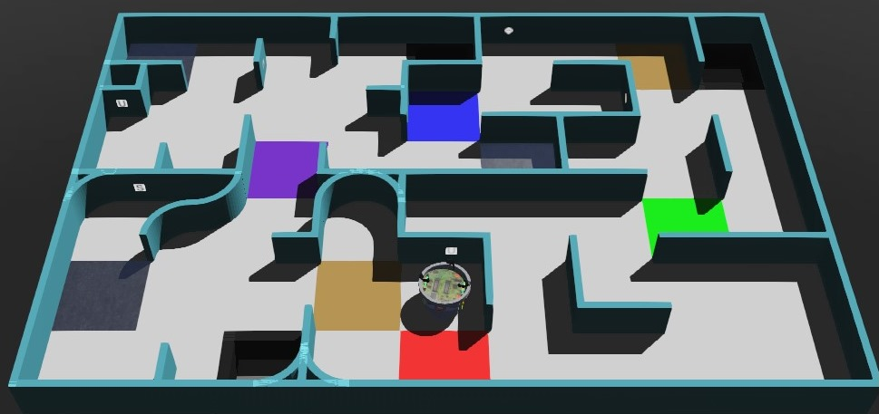

# ⚪ Introducción a la Robótica Simulada ⚪

La relevancia de la Robótica Simulada ha aumentado con el pasar de los años, sin duda se ha convertido en uno de los campos de estudio que se ha desarrollado enormemente y nos ha permitido realizar tareas relacionadas a la robótica física.

En el presente apunte, nos introduciremos a la Robótica Simulada Educativa.

## ◻ Ventajas de la Robótica Simulada ◻

Como se ha mencionado, el desarrolo de este campo nos permitió avanzar en Robótica de distintas maneras:

- Abarata los costos en la Industria: Antes de realizar robots físicos, es convenientes realizar un ambiente simulado con un prototipo virtual del robot físico. Esto nos permite identificar de qué manera se adaptará a los distintos entornos en los cuales será posicionado.

- Accesibilidad a componentes electrónicos: Desde cualquier lugar donde estemos y en cualquier momento, gracias al avance de los simuladores podemos acceder a sensores y otros componentes electrónicos que se utilizan recurrentemente en la industria.

- Manipulación de sensores y físicas: Los ambientes simulados también nos permiten programar y configurar los componentes a nuestro gusto, además que los simuladores poseen algoritmos que imitan las físicas del mundo real, asegurando una representación muy fiel a lo que ocurriría en la vida real.

## ◻ Robótica Simulada para Competencias ◻

Actualmente, las simulaciones nos han permitido construir y programar robots que puedan cumplir con distintos desafíos, dando surgimiento de esta manera a las competencias.

Tanto a nivel Nacional como Internacional, existen competencias de Robótica Simulada las cuales están orientadas a potenciar la creatividad y habilidades tecnológicas de sus participantes, además del trabajo en equipo.

El trabajo de cada Estudiante de Robótica Simulada es distinto, permitiéndole con estas herramientas introducirse a la Robótica, aprendiendo al mismo tiempo de qué manera funciona cada componente y su utilidad en aplicaciones reales.

